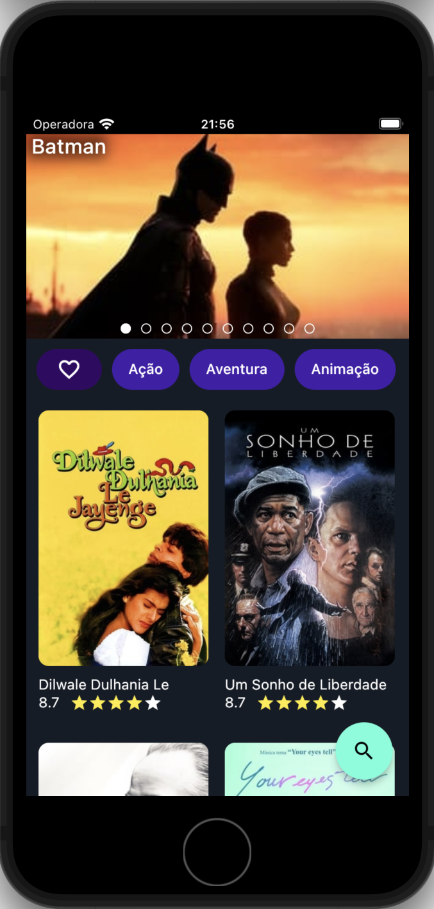
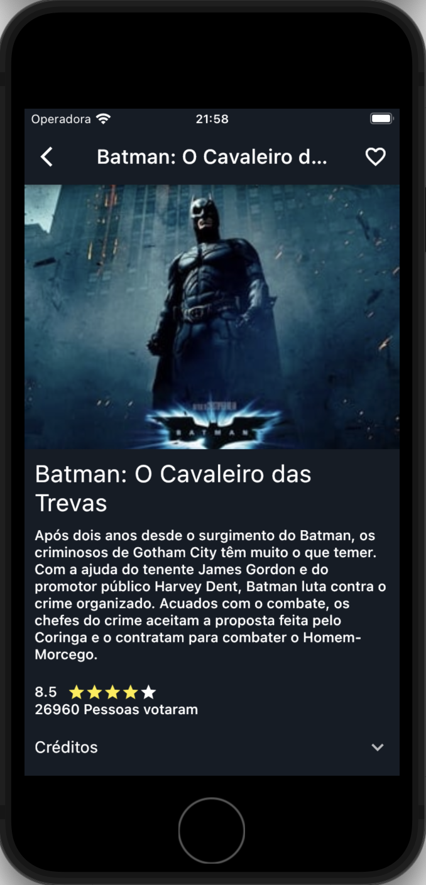
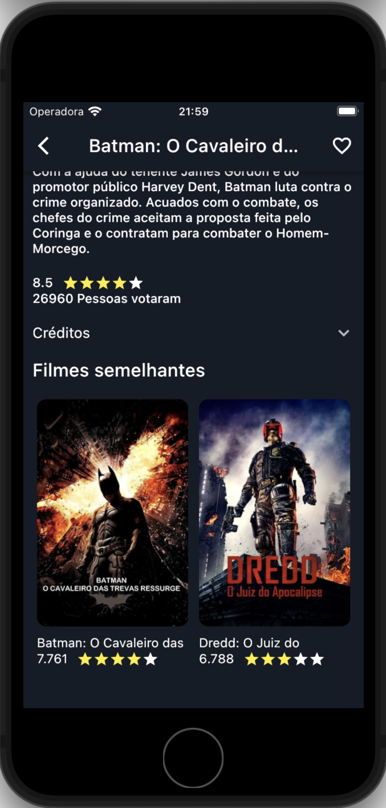
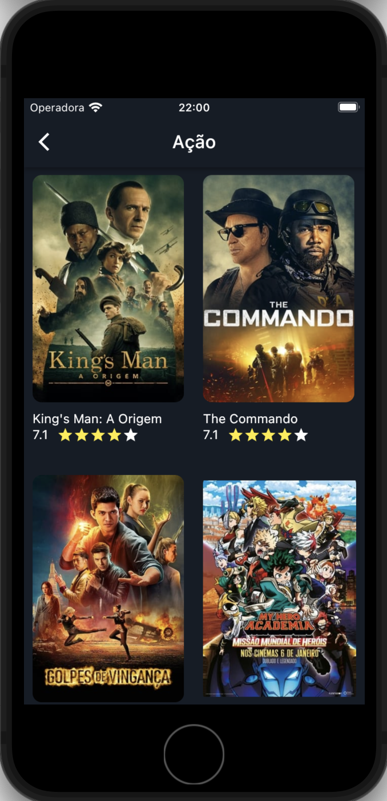
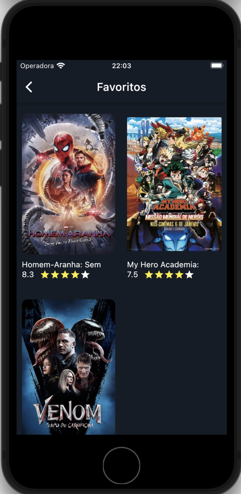
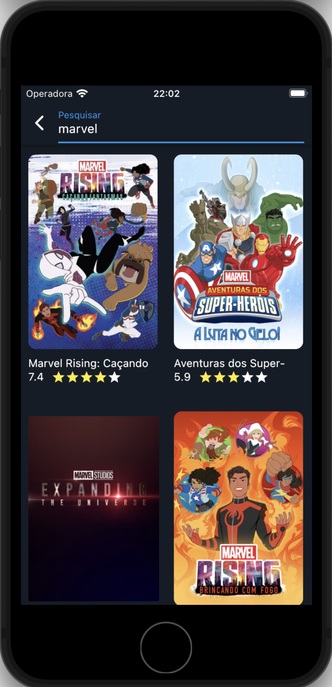

    

# Movie APP

Movie APP é um aplicativo que soluciona o problema de quem não consegue encontrar nada para assistir.

### Desenvolvimento
Este app foi desenvolvido afim de aprimoramento de conhecimentos de **arquitetura limpa**, levando em consideração o desempenho da aplicação e **clean code**. Além disso, esta aplicação foi desenvolvida utilizando as melhores praticas de controle de gestão de dependências

<a href="./assets/download/app.apk" download>Baixar App</a>

<h2 align="center">Demonstração</h2>

    

<h2 align="center">Capturas de tela</h2>

    
    

    
    

    
    

 

   Feito com ❤️ by <b>welitonsousa</b>

